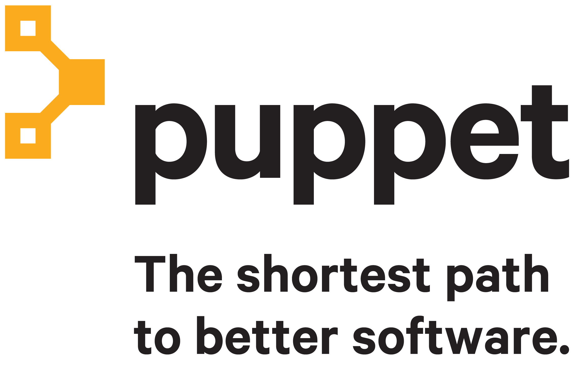
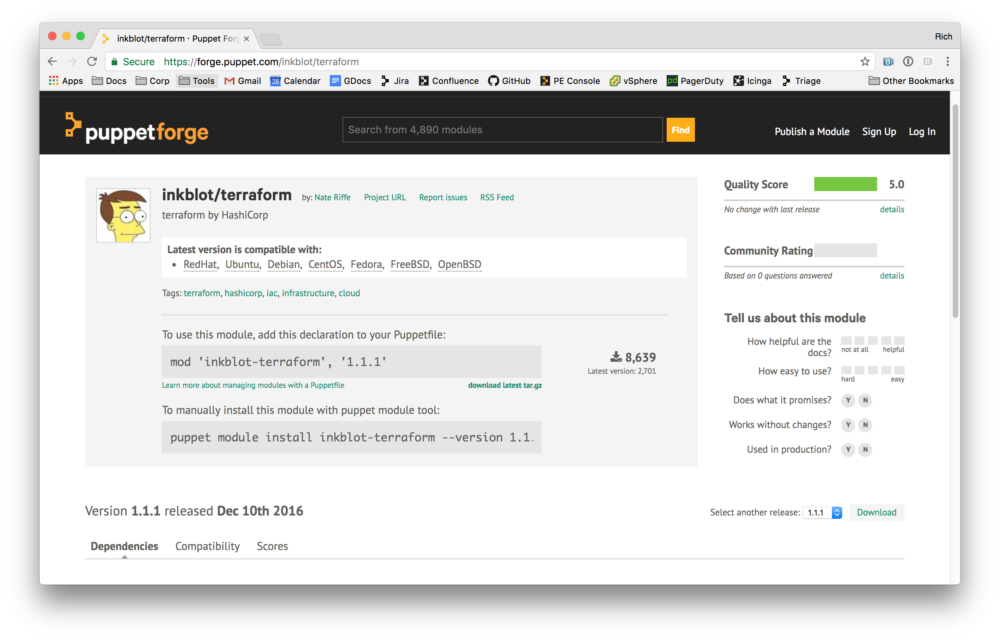

footer: @richburroughs - Portland Puppet User's Group

^ Before starting talk:
^ Connect to gw host
^ Source openrc

# Terraform and Puppet

## Rich Burroughs

---

## About me

- SRE at Puppet since September
- Previously a Puppet user for about 4 years
- Not a Terraform expert
- I hate bullet points

---


---




---

## Terraform is HashiCorp's provisioning tool

---


---


---

## "de-facto provisioning tool"

---

## Not a configuration management tool

---

## Terraform is like Puppet for provisioning

^ Not exactly the same but it uses a lot of the same concepts
^ Also will be familiar to Vagrant users

---

## Terraform is declarative

---

## Terraform has a DSL

---

## Terraform has a resource graph

^ implicit and explicit dependencies

---

## Terraform does not have a RAL

---

## Installing

---



---


``` Bash
alias tf='terraform'
```

---

## Providers

---

- AWS
- Azure
- GCP
- OpenStack
- GitHub
- Pager Duty
- many more

---

``` Ruby
provider "openstack" {
  user_name   = "admin"
  tenant_name = "admin"
  password    = "pwd"
  auth_url    = "http://myauthurl:5000/v2.0"
}
```

---

## Connection data

---

- tfvars
- Environment variables
- AWS credentials file

---

```Bash
source ~/.openrc.sh
```

---

``` Ruby
provider "openstack" {}
```

---

## Resources

---

``` Ruby
resource "openstack_compute_instance_v2" "web1" {
  name            = "web1"
  image_name      = "${var.image}"
  flavor_name     = "${var.flavor}"
  key_pair        = "${var.key_pair}"
  security_groups = "${var.security_groups}"

  network {
    name = "${var.network_name}"
  }
}
```

---

```Ruby
variable "image" {
  default = "centos_7"
}

variable "flavor" {
  default = "g1.medium"
}

variable "key_pair" {
  default = "my_key"
}

variable "network_name" {
  default = "network1"
}
```

---

## Dependencies

---

```Ruby
resource "openstack_compute_floatingip_v2" "fip_1" {
  pool = "${var.fip_pool}"
}

resource "openstack_compute_floatingip_associate_v2" "fip_assoc_1" {
  floating_ip = "${openstack_compute_floatingip_v2.fip_1.address}"
  instance_id = "${openstack_compute_instance_v2.web1.id}"
}
```

---

## depends_on

---

## Provisioners

---

- remote-exec
- local-exec
- file

---

## remote-exec could be "puppet apply"

---

## State

---

- Local JSON by default
- Consul
- Other backends (Dynamo DB)
- Atlas (Terraform Enterprise)

---

## Commands

---

```
terraform fmt
terraform show
terraform plan
terraform apply
terraform destroy
```
---

## Demo
